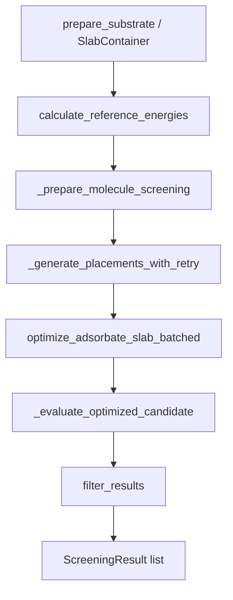
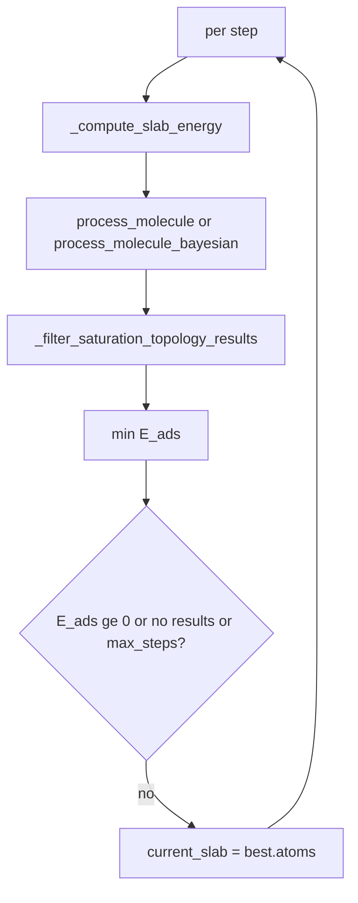
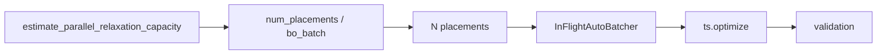
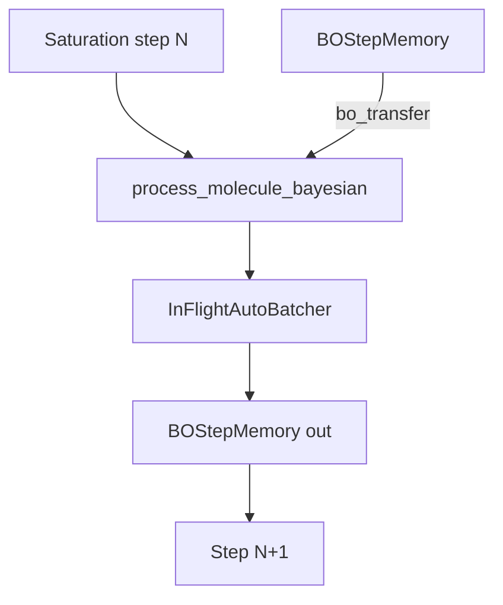

# Metalsurfer: core system

## Purpose and scope

Developer-oriented companion to [`README.md`](README.md) and the Sphinx [architecture guide](https://metalsurfer.readthedocs.io/en/latest/guides/architecture.html): module layout, implementation mechanics, and typed outputs. Install, run modes, and quickstarts stay in the README. Contributor workflow: [development guide](https://metalsurfer.readthedocs.io/en/latest/guides/development.html).

`scripts/` and `examples/` call the campaign APIs (`run_adsorption`, `run_saturation`, `run_*_bo`). On-disk layout follows the campaign layer (`results_{surface_type}/`, `step_*_placements/`, `saturation_placements_detailed.csv` when `saturation_save_all_placements` is true).

## Public API layers

Lazy re-exports in `metalsurfer.__init__` organize the public API into five layers. Heavy modules load on first access.

### 1. Run-mode APIs

Canonical high-level entry points:

- `run_adsorption(...)` — standard multi-molecule screening from an in-memory `(smiles, name)` list **or** a CSV path (same code path and outputs for both).
- `run_adsorption_bo(...)` — BO-guided screening; forces `bo_enabled=True`.
- `run_saturation(...)` — sequential saturation until coverage heuristic is met (**requires explicit** `molecules`).
- `run_saturation_bo(...)` — saturation with BO-guided placement selection and step-to-step transfer learning.

All four accept a `SlabContainer` (or plain ASE `Atoms`), `molecules` (list or CSV path), `AdsorptionConfig`, and `surface_type`.

`run_adsorption` / `run_adsorption_bo` return `BindingCampaignResult`.
`run_saturation` / `run_saturation_bo` return `SaturationCampaignResult` (per-molecule or multi-molecule runs via `.runs`).

With `save_results=True` (default):

- **Binding** campaigns call `save_single_molecule_results` per molecule and `save_summary_results` for campaign CSVs (`adsorption_energies_detailed.csv`, `adsorption_energy_summary.csv`), and append ML rows via `DatasetLogger`.
- **Saturation** campaigns call `save_saturation_results` (and optionally flatten step placements to `adsorption_energies_detailed.csv` when `save_benchmark_dataset=True`).

`skip_existing=True` (default) skips molecules already listed in `adsorption_energies_detailed.csv` (binding) or `saturation_summary.csv` (saturation), for **both** in-memory lists and CSV paths.

### 2. Surface preparation API

`prepare_substrate(...)` in `metalsurfer.surface_prep` builds or loads a slab, **equilibrates ionic positions by default** (`slab_relaxation_mode="ionic_only"`), optionally applies alloy substitution and adatom deposition, and attaches ASE `FixAtoms` via prep kwargs (`relax_top_layer`, `freeze_symbols`; default: entire substrate frozen). Prep-time relaxation knobs mirror `AdsorptionConfig.slab_relaxation_*`. Writes `clean_slab*` artifacts under `results_dir`.

Also exported from `metalsurfer.surface_prep`: `finalize_substrate`, `relax_substrate`, `resize_substrate_for_molecule`, `create_slab_from_bulk`, `create_slab_from_atoms`, `substitute_alloy`, `deposit_adatoms`, `auto_resize_substrate_for_molecule`, `compute_minimum_supercell`.

### 3. Workflow APIs (internal)

Orchestration helpers used by campaigns:

- `_normalize_molecules_input(...)` — unify CSV path and in-memory `(smiles, name)` lists for binding and saturation campaigns.
- `_bootstrap_screening_run(...)` — validate substrate, setup MLIP, and compute reference energies (shared by binding and saturation).
- `run_saturation_screening(...)` — saturation loops (`workflow/saturation.py`).

`load_molecules` / `load_molecules_from_pairs` live in `workflow/shared.py`. CSV files may include an optional header row (`smiles,molecule`).

### 4. Mid-level per-molecule APIs

- `process_molecule(...)` — standard placement screen (preamble via `_prepare_molecule_screening`).
- `process_molecule_bayesian(...)` — BO-guided screen (same shared preamble).
- `calculate_reference_energies(...)`
- `load_molecules(...)`

### 5. Infrastructure APIs

**Surfaces and placement:** `enumerate_placement_specs`, `generate_placement_from_spec`, `generate_placement_from_descriptor`, `calculate_min_distance`, `get_symmetry_aware_sites`, `get_symmetry_info`.

**Optimization:** `setup_calculator`, `setup_single_model`, `setup_torchsim_model`, `TorchSimCalculator`, `optimize_isolated_molecules_batched`, `optimize_adsorbate_slab_batched`, `batch_static`, `identify_relaxable_surface_indices`, `identify_top_layer_indices`, `compute_frozen_indices`, `frozen_indices_from_constraints`.

**Filtering:** `filter_results`, `check_decomposition`, `check_desorption`.

**I/O:** `setup_directories`, `results_dir`, `save_molecule_results`, `save_single_molecule_results`, `screening_run_result`, `save_summary_results`, `save_saturation_results`, `save_multi_mol_saturation_results`, `write_run_metadata`, `write_run_settings` (both merge into `run_metadata.json`; `write_run_metadata_from_out` is internal to campaigns).

**ML:** `DatasetLogger`, `PlacementRecord`, `ComputationContext`, `BindingEnergyPredictor`, `extract_features`, `extract_features_from_dataset`, `train_model`, `evaluate_model`, `grouped_cross_validate`, `load_dataset`.

**Symmetry:** `SymmetryAnalyzer`, `SymmetryAnalysisError`.

**Logging and errors:** `configure_logging`; `DependencyMissingError`, `GeometryValidationError`, `OptimizationError`.

## Computational pipeline

Across run modes the physical stages are: surface prep → reference energies → conformers → placement → TorchSim relaxation → validation/filtering → persistence.

### Standard screening (`process_molecule`)

### Sequential saturation (`run_saturation_screening`)

### Binding energy and references

Adsorption energy is always:

`E_ads = E_adslab - E_slab - E_molecule`

computed in `workflow/shared._evaluate_optimized_candidate`.

- **Saturation** recomputes `E_slab` every step from the current (partially covered) slab via `slab_energy_override`. Isolated `E_molecule` stays from the initial `calculate_reference_energies` call.
- Reference `E_molecule` is the **lowest energy among MLIP-optimized conformers** per molecule (`workflow/reference.py`).
- Clean-slab reference energy must be finite and not ~0; otherwise `OptimizationError` is raised.
- Undersized in-plane cells are rejected at campaign entry; expand during prep with `resize_substrate_for_molecule` / `auto_resize_substrate_for_molecule` from `metalsurfer.surface_prep`.

## Campaign routing and entry points

| API | `molecules` input | Code path | Persistence / extras |
|-----|-------------------|-----------|----------------------|
| `run_adsorption` / `run_adsorption_bo` | **CSV path or in-memory list** | `campaigns._run_binding_campaign` → `_normalize_molecules_input` + `_bootstrap_screening_run` | XYZ/CSV summaries, `DatasetLogger`, `MoleculeCampaignSummary`, `failure_summaries`, `skip_existing` |
| `run_saturation` / `run_saturation_bo` | **CSV or list** | `run_saturation_screening` → `_normalize_molecules_input` + `_bootstrap_screening_run` | `save_saturation_results`; optional `save_benchmark_dataset` |

Both binding and saturation paths share `process_fn` = `process_molecule` or `process_molecule_bayesian` where applicable.

## Module architecture

- `config.py`: `AdsorptionConfig` and validation.
- `models.py`: typed contracts for references, placements, screening, saturation, timing, campaigns.
- `surfaces.py`: slab construction, alloys, adatoms, supercell resizing, validation, `SlabContainer`.
- `surface_prep/`: canonical substrate prep API (`prepare_substrate`, `finalize_substrate`, re-exports).
- `conformers.py`: SMILES → conformers, isolated optimization, conformer selection.
- `placement/`: orientation-aware sites (`sites.py`: hybrid topology + Voronoi), local-frame geometry (`geometry.py`), material-aware PBC (`_material.py`), enumeration policy (`policy.py`), spec materialization and replay (`generators.py`).
- `symmetry.py`: `spglib`-based symmetry and site orbits.
- `optimization.py`: TorchSim batched relaxation, freeze masks, autobatching.
- `filters.py`: decomposition, desorption, deduplication.
- `workflow/`: orchestration by run mode + `shared.py` validation/autotune helpers.
- `campaigns.py`: high-level campaign wrappers and persistence hooks.
- `io_results.py`: CSV, XYZ, optional VASP I/O, metadata.
- `ml/`: dataset logging, features, surrogates, acquisition, reproduction utilities.
- `exceptions.py`, `_logging.py`: errors and structured logging.

Workflow subpackage:

- `core.py` — standard per-molecule screening + `_evaluate_placement_batch` (`process_molecule` always returns `list[ScreeningResult]`, possibly empty).
- `bayesian.py` — BO-guided per-molecule screening.
- `saturation.py` — single- and multi-molecule saturation.
- `reference.py` — reference-energy preparation.
- `shared.py` — molecule loading, `_bootstrap_screening_run`, `_prepare_molecule_screening`, site context, validation, workload autotune.

## Implementation mechanics

### Surfaces and slab containers

`metalsurfer.surface_prep` is the canonical import path for all substrate
and material preparation. See [surface_prep API](https://metalsurfer.readthedocs.io/en/latest/api/surface_prep.html) for the full API.

**Prep (before campaign APIs):** `prepare_substrate`
(recommended), or lower-level helpers finalized with
`finalize_substrate`. Optional in-plane sizing via
`resize_substrate_for_molecule` after conformer
generation. `relax_substrate` equilibrates loaded or pre-built slabs when
`slab_relaxation_mode` is set. `create_slab_from_bulk` and `create_slab_from_atoms` align geometry
but are not campaign-ready until PBC and constraints are applied.

**Campaign entry points:** `run_adsorption`, `run_saturation`, and related APIs call `accept_substrate_for_api` / `validate_substrate` only—they do not align, resize, or rewrite constraints. Freeze policy during adsorbate relaxation is read from ASE `FixAtoms` on the substrate reference via `frozen_indices_from_constraints`.

### Site detection (`placement/sites.py`)

Site generation is **orientation-aware**: slab top-layer detection, Voronoi filtering, topology candidates, and local normals use the slab normal (`a × b`) and slab-plane projectors—not Cartesian `z`.

1. **Framework geometry:** Periodic images (3×3×1 slabs, 3×3×3 porous, none for clusters) before Voronoi.
2. **Voronoi distance window:** `_derive_voronoi_distance_window` sets default probe/max distances from framework covalent radii. Slabs use **top-layer** atoms along the slab normal; nanoparticles and porous frameworks use mean radii over all atoms (no z-slice heuristic).
3. **Voronoi input (slabs):** Voronoi tessellation runs on **near-surface atoms only** (top layer, ≥4 atoms). NN distances for vertex filtering still reference the full framework via `nn_reference_positions`.
4. **Hybrid slab generator (default):** Topology-derived atop / bridge / hollow candidates from a Delaunay triangulation of the top layer in the slab plane, merged with Voronoi enrichment. Bridge midpoints come from triangulation edges; hollows from triangle centroids (with distance-ratio fallback when Delaunay is unavailable).
5. **Voronoi vertices:** Filtered to the primary cell; each vertex must lie between `voronoi_probe_radius` and `voronoi_max_site_distance` from the nearest framework atom.
6. **Enrichment:** Ridge subdivision when `voronoi_site_enrichment` is true.
7. **Typing:** atop / bridge / hollow / pore via:
   - **distance ratios** on the six nearest framework neighbours (`_SITE_CLASSIFICATION_NEIGHBOURS=6`), or
   - **Delaunay** classification in the top-layer plane when `site_classification_method == "delaunay"` (slabs).
   Bridge candidates from topology use Delaunay edges rather than KDTree radius pairs. Hollow sites carry optional `hollow_order` metadata (3- or 4-fold); labels remain `hollow`.
8. **Site dict fields:** Each site exposes `xyz`, local `normal`, `site_type`, `slab_indices`, `env_fingerprint`, `site_source` (`voronoi`, `topology_atop`, …), and `material_type`. Legacy `xy`/`z` keys remain for logging but slab placement uses `xyz` + normal offset.
9. **Deduplication:** Voronoi/topology merge uses periodic-aware `_deduplicate_points` (union-find, order-independent). `_cluster_equivalent_sites` merges symmetry-equivalent sites with material-type-aware metrics and matching fingerprints.
10. **Ordering:** Final site list is sorted by fractional coordinates in the cell for deterministic `site_index` assignment.

`placement.generators._get_unique_sites_for_specs` returns a `SiteContext` (`sites`, `use_sites`, `source`, `raw_unclustered`). A SHA-256 cache keyed by positions, cell, pbc, and Voronoi/cluster config bytes avoids recomputing identical site sets within a run.

### How the workflow chooses sites (`workflow/shared.py`)

`_resolve_site_context_for_sampling`:

1. **Cache:** Memoized from geometry hash + `symmetry_broken` (max 16 entries, lock-protected).
2. **Core:** Clustered Voronoi set via `_get_unique_sites_for_specs`.
3. **Symmetry broken:** Use clustered Voronoi only (saturation after coverage).
4. **Otherwise:** `get_symmetry_aware_sites` with reused `raw_unclustered` sites. On `SymmetryAnalysisError` or empty result, fall back to clustered Voronoi.

### Surface reference slab for site discovery

`_build_surface_reference_slab` strips atoms whose elements are not in the original freeze-reference substrate. Site enumeration and desorption distance checks use this **substrate-only** view while the full slab+adsorbates structure is relaxed. Critical for saturation steps after prior adsorbates are committed.

### Placement enumeration and materialization

- **`placement/policy.py`:** Cartesian product over conformers, sites, orientation (flat-aromatic parallel vs EN-down, dissociative branch), tilts, azimuths, z-fractions. Subsampled to budget with seeded random draw when grid exceeds `n_desired`.
- **`placement/generators.py`:** Molecule metadata (shape, binders, dissociative flag). Optional `placement_filter` callback and `adaptive_parallel_fraction`.
- **Slab placement center:** For `material_type=="slab"`, the adsorbate anchor is `site["xyz"]` offset along the slab normal to `surface_ref + z_offset` (from `placement_z_range` and `spec.z_fraction`). Nanoparticle/porous paths offset along the site local normal. Rotations/tilts use `compute_surface_site_frame(normal)` in `geometry.py` (no forced “z-up” flip).
- **Dissociative branch:** Homonuclear diatomics (e.g. H₂) on **slabs** or **nanoparticles** generate dissociative specs when `skip_topology_check=True` (topology/decomposition checks disabled). Slabs use hollow/pore site pairs; nanoparticles use Voronoi site pairs with outward normals from the cluster center or site metadata. Each fragment is offset along its site normal (not necessarily the slab normal). Porous frameworks reject dissociative placement. Centroid absolute coordinates populate the descriptor.
- **`workflow/shared._materialize_spec_placements`:** Materializes each `PlacementSpec`; failures become `PlacementFailureEvent` records (BO negative labels when enabled).

#### ML/BO injectivity (spec → geometry → features)

The surrogate sees **resolved absolute geometry**, not discrete site IDs or orientation labels.

| Stage | Role |
|-------|------|
| `PlacementSpec` | Enumeration template: conformer, `site_index`, orientation knobs, `z_fraction`, … |
| `generate_placement_from_spec` | Deterministic materialization → `PlacementDescriptor` + adsorbate `Atoms` |
| `PlacementDescriptor` / `PlacementPose` | Stores `x_abs`, `y_abs`, `z_abs`, unit quaternion, conformer index (plus metadata for CSV/logging) |
| `extract_features` | **8 features only:** `x`, `y`, `z`, `conformer_index`, `quat_w/x/y/z` from absolute fields |

**Not in the feature vector:** `site_index`, `site_type`, `hollow_order`, `orientation_type`, `tilt_deg`, `azimuth_*`, `z_fraction`, `face_flip`. Two specs that land at the same absolute pose are intentionally indistinguishable to the model.

**Replay paths (all tested):**

1. `generate_placement_from_spec` — spec → pose → adsorbate
2. `generate_placement_from_descriptor` — stored descriptor quat + absolute coords → adsorbate
3. `generate_placement_from_pose` — pose round-trip

BO candidate features are built via `build_spec_features_geometry_aware` (`ml/bayesian.py`): each unevaluated spec is materialized, converted to `PlacementRecord`, then `extract_features`. Failed specs are skipped; `valid_indices` maps feature rows back to the spec pool.

**Determinism guardrails:** fractional site ordering, order-independent dedup/clustering, geometry-keyed site cache, seeded spec subsampling. Site-detection improvements (orientation-aware slabs, hybrid topology, k=6 classification) may change which sites exist vs older code versions, but within a fixed code version + fixed slab the mapping `site_index → xyz` is stable.

### Placement retry (`workflow/core.py`)

`_generate_placements_with_retry`: when `placement_retry_enabled` (default on), up to `placement_retry_max_attempts=3` rounds with `placement_retry_diversity_seed_increment=1000` offset seeds fill only the **remaining** placement deficit.

### Conformer generation (`conformers.py`)

RDKit embed + MMFF relax; MLIP energy scoring via `batch_static` when available. `remove_duplicate_conformers` collapses near-duplicates.

`conformer_sampling` (default `cycle`): round-robin by `placement_id`; `boltzmann` at `boltzmann_temperature` (300 K); `mixed` alternates cycle/Boltzmann by placement id parity. `select_conformer_boltzmann` is also exported.

### Surface preparation relaxation vs adsorption relaxation

**Prep (ASE):** `slab_relaxation_mode` (`none`, `ionic_only`, `cell_only`, `full`; default `ionic_only`) during `prepare_substrate` / `relax_substrate` / `create_slab_from_bulk` / `deposit_adatoms`. Loaded nanoparticles are re-anchored to `min(z)=0` after relaxation. Outputs `clean_slab.xyz` (pre-adatom) and e.g. `clean_slab_Au20.xyz` (post-adatom)—compare optimized adsorption structures to the **post-adatom** reference, not pre-adatom files.

**Adsorption (TorchSim):** See **TorchSim batched relaxation** below. `frozen_indices_from_constraints` reads ASE `FixAtoms` on the substrate reference (attached at prep). `log_substrate_freeze_policy` logs frozen vs moving substrate atoms at campaign start. Saturation pins `base_slab_for_frozen` at campaign start; prior adsorbate units (indices ≥ original substrate length) may relax. In-plane sizing must be done during prep via `auto_resize_substrate_for_molecule` / `resize_substrate_for_molecule`.

### TorchSim batched relaxation (`optimization.py`)

Core differentiator vs sequential DFT workflows (AdsorbML, BOSS): many slab+adsorbate relaxations run **in parallel** on GPU.

| Mechanism | Role |
|-----------|------|
| `optimize_adsorbate_slab_batched` + `InFlightAutoBatcher` | Pack N independent relaxations per GPU wave |
| `estimate_parallel_relaxation_capacity` | Probe `determine_max_batch_size` / memory scalers (0.8 × `autobatcher_max_memory_padding`) |
| `resolve_workload_config` | Autotune `num_placements`, `bo_initial_random`, `bo_batch_size` when `None` |
| `resolve_saturation_step_workload_config` | Re-probe as slab grows each saturation step |
| `stage1_steps` + `stage2_steps` (50 + 150) | Two-stage `ts.optimize`; default `ts_optimizer` = FIRE |
| `optimize_isolated_molecules_batched`, `batch_static` | Reference conformer energies |
| `_AUTOBATCHER_CACHE`, `clear_autobatcher_cache` | Cache keyed by model/device/padding/`max_n_atoms`; CUDA GC on eviction |
| `saturation_reuse` + `saturation_autobatcher_reuse` | Reuse prior autobatcher if slab growth ≤ 32 atoms or 10%; OOM → drop cache, re-probe, retry once |

Omitting `num_placements` (and BO batch fields) is intentional: the library sizes parallel work to available GPU memory.

### Calculator and PBC constraints

- `_prepare_atoms_for_calculator` (`workflow/shared.py`): mixed PBC normalized to full periodic; periodic c-vector must be ≥ 18 Å (`MIN_CALCULATOR_CELL_C_ANG`) to avoid image self-interaction with UMA.
- `_validate_model_pbc` (`optimization.py`): rejects mixed PBC for TorchSim/UMA paths.

### Reference energies (`workflow/reference.py`)

Per molecule: embed conformers → `optimize_isolated_molecules_batched` → lowest energy wins. Clean slab: single-point with finite/non-zero guards. Failures respect `fail_on_conformer_failure` / `fail_on_missing_reference`.

### Validation layers

Three intentional layers:

1. **Per-candidate** (`_evaluate_optimized_candidate`): finite energy, `min_interatomic_distance`, adsorbate force cap (`max_force_convergence`), desorption distance (`binding_distance_threshold`, skippable via `skip_desorption_check`), `max_adsorption_energy` cap.
2. **Batch** (`filter_results`): decomposition vs reference SMILES (`skip_topology_check` disables), desorption re-check, energy/RMSD dedup (`energy_dedup_threshold`, `rmsd_dedup_threshold`).
3. **Saturation step** (`_filter_saturation_topology_results`): full adsorbate pool must have expected connected-fragment count (`adsorbate_connected_components`); connectivity-only guard allowing strong chemisorption. Disabled when `saturation_discard_topology_rearrangements=False` or `skip_topology_check=True`.

During saturation placement filtering, decomposition uses `adsorbate_prefix_atoms=len(slab)` so only the newly added adsorbate is checked at the batch layer.

### Post-relaxation filtering (`filters.py`)

`filter_results` orchestrates decomposition, desorption, energy cap, and duplicate removal. Exported helpers: `check_decomposition`, `check_desorption`.

### Shared batch evaluation (`workflow/core.py`)

`_evaluate_placement_batch`: materialize specs → `optimize_adsorbate_slab_batched` → per-candidate validation. Used by BO acquisition loops and saturation internals.

### Failure tracking (`workflow/shared.py`)

`PlacementFailureEvent` records `placement_id`, `stage` (`generation`, `optimization`, `validation`, `energy_cap`, `filter`), and `reason`. Aggregated in logs; fed to BO as penalty labels when `bo_include_failure_negatives=True`. Campaign APIs accept `failure_summary_out` dicts for per-molecule diagnostics.

### Symmetry analysis (`symmetry.py`)

`SymmetryAnalyzer` + `spglib`; orbit grouping with `symmetry_tolerance`. Saturation detects symmetry breaking vs the initial reference slab (`_saturation_symmetry_broken_vs_reference`) and disables symmetry reduction for later steps.

### Bayesian screening (`workflow/bayesian.py` + `ml/bayesian.py`)

Finite `PlacementSpec` pool → initial batch (`bo_initial_sampling`, default **`spread_xyz`**: farthest-point on resolved x/y/z) → **geometry-aware features** (`build_spec_features_geometry_aware`: materialize each spec, extract absolute pose features) → surrogate → acquisition batches (LCB, EI, PI; default EI) until `bo_total_budget` (18) acquisition rounds after the initial batch.

**Surrogates** (`bo_surrogate`): `random_forest`, `extra_trees`, `gradient_boost` (HistGradientBoostingRegressor internally), `ridge` (default), `ensemble` (trees + ridge + optional Gaussian-process member). Tree models and `ensemble` provide uncertainty; ridge/HGB use deterministic acquisition limits. `gradient_boost` cannot be used with `bo_transfer_enabled` (config validation).

Eval budget once autotuned: `bo_initial_random + bo_total_budget * bo_batch_size` (`resolved_bo_eval_budget`).

Failed placements: `bo_include_failure_negatives=True` (default) with `bo_failure_penalty_default=10.0` eV and stage overrides in `bo_failure_penalty_overrides`.

### BO and transfer learning for deep saturation

`run_saturation_bo` forces `bo_enabled=True`. Each saturation step runs `process_molecule_bayesian`, which emits a `BOStepMemory` (observed feature rows + energies). The next step receives prior memory via `_bo_transfer_memory_in`:

| Mode | Behavior |
|------|----------|
| `weighted` (default) | `windowed_bo_step_memories` over last `bo_transfer_prior_step_window=2` steps; recency (`bo_transfer_recency_lengthscale=4.0`), occupancy, and similarity weighting; `bo_transfer_weight_cap=0.35` |
| `cumulative_refit` | `merge_bo_step_memories` of all prior steps |

`build_transfer_surrogate` combines current and prior observations; trust logic (`bo_transfer_trust_patience`, `bo_transfer_mae_tolerance`) auto-disables transfer when it hurts fit. Step results expose `bo_transfer_used`, `bo_transfer_weight_share`, `bo_transfer_bad_rounds`, etc. on `SaturationStepResult` / `MultiMolSaturationStepResult` (written to saturation CSV/metadata).

Multi-molecule saturation keeps **per-adsorbate** `BOStepMemory` chains (`_validate_distinct_bo_memories` prevents cross-species sharing). Pair with `saturation_autobatcher_reuse` to amortize GPU memory probes over many coverage steps.

### Multi-molecule saturation (`workflow/saturation.py`)

When `multi_molecule_saturation=True` and multiple molecules are loaded:

- Pre-resize once using the largest conformer.
- Per-step placement budget via `distribute_placement_budget` proportional to `estimate_molecule_complexity`.
- Each molecule screened independently; **lowest `E_ads` across all molecules wins the step**.
- Returns a single `MultiMolSaturationRunResult` with `molecule_counts` and per-step `winning_molecule`.

Single-molecule saturation returns a list of `SaturationRunResult` with `n_molecules_at_saturation` derived from committed steps.

**Stop conditions:** best `E_ads ≥ 0`; no valid placements after topology guard; `saturation_max_steps` reached (default unlimited).

## Run modes and pipeline

High-level narrative also appears in the [architecture guide](https://metalsurfer.readthedocs.io/en/latest/guides/architecture.html).

| Mode | Entry | Summary |
|------|-------|---------|
| Standard screening | `run_adsorption` / `process_molecule` | Sample N placements, parallel TorchSim relax, filter, return valid `ScreeningResult` list |
| Bayesian screening | `run_adsorption_bo` / `process_molecule_bayesian` | BO over finite spec pool + batched MLIP relax |
| Saturation | `run_saturation` | Sequential coverage until next adsorption is endothermic |
| Saturation + BO | `run_saturation_bo` | Saturation with transfer-learning BO per step |

**Saturation notes:**

- `E_slab` refreshed each step; compare structures to post-adatom substrate files when adatoms were deposited.
- In-plane supercell sizing must be completed during prep before calling campaign APIs.
- `saturation_discard_topology_rearrangements=True` (default): step-level connectivity guard before ranking.

## Material types and site generation

`material_type`: `"slab"`, `"nanoparticle"`, or `"porous"`. Affects PBC handling, Voronoi image replication, surface-normal construction, top-layer masking, hybrid topology enrichment (slabs), and adsorption distance validation (`placement/_material.material_aware_pbc`).

| Type | Site strategy (high level) |
|------|----------------------------|
| `slab` | Top layer along slab normal → hybrid topology (atop/bridge/hollow) + Voronoi enrichment; Voronoi tessellation on top-layer atoms only |
| `nanoparticle` | Full-framework Voronoi; outward normals; no PBC images |
| `porous` | 3×3×3 periodic images; pore sites when framework spans much of the cell z-extent |

Key site hyperparameters: `voronoi_probe_radius`, `voronoi_max_site_distance`, `top_layer_tolerance`, `symmetry_tolerance`, `site_equivalence_tolerance` (default 0.05 Å), `site_classification_method` (`distance_ratio` or `delaunay`).

## Typed data model (`models.py`)

| Type | Role |
|------|------|
| `ReferenceEnergies` | `slab_energy` + per-molecule energy dict |
| `PlacementSpec` / `PlacementDescriptor` | Enumeration template vs realized placement metadata (site, orientation, tilt, quaternion, …) |
| `ScreeningResult` | One validated placement: energies, `atoms`, `slab_size`, `distance`, descriptor |
| `ScreeningRunResult` | Per-molecule results + `to_rows()` / `to_summary_row()` for CSV |
| `SaturationStepResult` | Step index, best result, `all_results`, BO transfer diagnostics |
| `SaturationRunResult` | Full step history for one molecule + `n_molecules_at_saturation` |
| `MultiMolSaturationStepResult` | Competitive step: `winning_molecule`, per-molecule results, budgets |
| `MultiMolSaturationRunResult` | Full competitive run + `molecule_counts`, `final_slab_atoms` |
| `BindingCampaignResult` / `SaturationCampaignResult` | Campaign wrappers: mode, timing, failure summaries |
| `BOStepMemory` | Transfer payload; helpers `windowed_bo_step_memories`, `merge_bo_step_memories` |
| `MoleculeCampaignSummary` | Best E_ads, valid count, parallel/EN-down orientation counts |
| `TimingInfo` | Per-stage wall times logged in `process_molecule` |

## Configuration model

`AdsorptionConfig` centralizes physical and workflow knobs. User-facing field documentation: [docs/api/config.rst](docs/api/config.rst) and [docs/guides/configuration.rst](docs/guides/configuration.rst). Representative defaults (verify in `config.py` when debugging):

| Field | Default |
|-------|---------|
| `model_name` | `"uma-s-1p1"` |
| `num_placements` | `None` (GPU autotune) |
| `conformer_sampling` | `"cycle"` |
| `bo_surrogate` | `"ridge"` |
| `bo_initial_sampling` | `"spread_xyz"` |
| `bo_total_budget` | `18` acquisition batches |
| `bo_transfer_enabled` | `True` |
| `bo_transfer_mode` | `"weighted"` |
| `bo_transfer_prior_step_window` | `2` |
| `bo_transfer_weight_cap` | `0.35` |
| `saturation_autobatcher_reuse` | `True` |
| `autobatcher_max_memory_padding` | `0.5` |
| `min_pbc_image_separation` | `8.0` Å |

### Sampling and placement

- `num_conformers`, `num_placements`, `placement_x/y/z_range`, `placement_z_scale_by_covalent_radius`
- `conformer_sampling`, `boltzmann_temperature`, `placement_filter` (optional callback)
- `placement_retry_enabled`, `placement_retry_max_attempts`, `placement_retry_diversity_seed_increment`
- `min_initial_distance`, `max_initial_distance`, `min_contact_ratio`
- `flat_aromatic_parallel_fraction`, `adaptive_parallel_fraction`
- Voronoi/classification: `voronoi_*`, `site_classification_method`, `rough_slab_local_z`, `hollow_site_dedup_tolerance`, `planar_z_variance_threshold`

### Placement validation (initial geometry)

- `strict_initial_placement`, `reject_vdw_overlaps`, `vdw_overlap_scale`
- `min_contact_distance`, `min_contact_atoms`, `contact_distance_threshold`, `require_multiple_contact`

### Relaxation and validation

- `model_name`, `device`, `fmax`, `stage1_steps`, `stage2_steps`, `reference_optimization_steps`
- `optimize_isolated_sequentially`
- `min_interatomic_distance`, `max_force_convergence`, `binding_distance_threshold`, `max_adsorption_energy`
- `skip_desorption_check`, `skip_topology_check`
- `connectivity_multipliers`, `energy_dedup_threshold`, `rmsd_dedup_threshold`

### Surface prep and TorchSim autobatching

- `slab_relaxation_mode`, `slab_relaxation_optimizer`, `slab_relaxation_fmax`, `slab_relaxation_steps`
- `min_pbc_image_separation`, `vacuum_box_size`
- `ts_optimizer`, `steps_between_swaps`
- `autobatcher_max_memory_padding`, `autobatcher_max_memory_scaler`, `autobatcher_max_atoms_to_try`
- `saturation_autobatcher_reuse`, `saturation_autobatcher_reuse_growth_atoms`, `saturation_autobatcher_reuse_growth_fraction`

### Bayesian optimization

- `bo_enabled`, `bo_initial_random`, `bo_batch_size`, `bo_total_budget`
- `bo_initial_sampling`, `bo_ucb_kappa`, `bo_acquisition`, `bo_surrogate`, `bo_candidate_pool_size`
- `bo_include_failure_negatives`, `bo_failure_penalty_default`, `bo_failure_penalty_overrides`
- `bo_transfer_enabled`, `bo_transfer_mode`, `bo_transfer_min_step_observations`, `bo_transfer_weight_cap`
- `bo_transfer_similarity_lengthscale`, `bo_transfer_min_similarity`, `bo_transfer_trust_patience`, `bo_transfer_mae_tolerance`
- `bo_transfer_exploration_fraction`, `bo_transfer_proximity_*`, `bo_transfer_prior_step_window`
- `bo_transfer_recency_lengthscale`, `bo_transfer_occupancy_lengthscale`, `bo_transfer_occupancy_floor`

### Saturation behavior

- `multi_molecule_saturation`, `saturation_save_all_placements`, `save_benchmark_dataset`
- `saturation_discard_topology_rearrangements`, `saturation_max_steps`

### Reproducibility, I/O, strictness

- `seed`, `fail_on_missing_reference`, `fail_on_conformer_failure`, `debug_write_initial_placements`
- `write_vasp_inputs`, `vasp_*` parameters

The `multi_molecule_saturation` flag is a metadata hint; actual behavior is determined by which API is called and how many molecules are loaded.

## Output model and persistence

Root directory: `results_{surface_type}/`.

| File / directory | When written |
|------------------|--------------|
| `adsorption_energies_detailed.csv`, `adsorption_energy_summary.csv` | Binding campaigns |
| `saturation_summary.csv`, `saturation_details.csv` | Saturation campaigns |
| `saturation_placements_detailed.csv`, `xyz_structures/.../step_{NNN}_placements/` | `saturation_save_all_placements=True` (default) |
| `adsorption_energies_detailed.csv` (flattened from saturation steps) | `save_benchmark_dataset=True` |
| `ml_dataset.csv`, `ml_dataset_metadata.json` | `DatasetLogger` during binding campaigns and saturation |
| `xyz_structures/`, optional `vasp_inputs/` | Always / when `write_vasp_inputs=True` |
| `run_metadata.json` | Campaign `write_settings` / `write_metadata` flags (merged incrementally) |

Rows include `schema_version` and computation context (`model_name`, `fmax`, `stage1_steps`, `stage2_steps`, `seed`, context hash) when config is passed to save helpers.

## Dataset logging and ML support

`DatasetLogger` (`ml/dataset.py`) appends `PlacementRecord` rows during binding campaigns and saturation; flushed to `ml_dataset.csv`. `PlacementRecord.from_screening_result` captures placement descriptors and energies; deduplicated duplicates can be tagged `label_source="deduplicated_duplicate"` for ML training.

**Feature schema (`ml/features.py`):** eight numeric columns—absolute adsorbate anchor `(x, y, z)` from `x_abs`/`y_abs`/`z_abs`, `conformer_index`, and a sign-normalized unit quaternion. Categorical placement metadata (site type, orientation label, `z_fraction`, `face_flip`) is persisted in CSV/dataset rows for analysis but **excluded from training features** so the surrogate learns a geometry-only map consistent with BO candidate encoding.

Public ML utilities beyond BO:

- `extract_features` / `extract_features_from_dataset`
- `train_model`, `evaluate_model`, `grouped_cross_validate`, `BindingEnergyPredictor`
- `load_dataset`; `ml/reproduce.py` can rebuild `AdsorptionConfig` from saved context rows

Schema versioning lives in `ml/schema.py` (`SCHEMA_VERSION`, `ComputationContext`).

## Comparison with AdsorbML and BOSS

Shared goal: find low-energy adsorbate–surface configurations and report \(E_\mathrm{ads} = E_\mathrm{adslab} - E_\mathrm{slab} - E_\mathrm{molecule}\).

**References:** AdsorbML — Ulyssi et al., [npj Comput. Mater. 9, 172 (2023)](https://doi.org/10.1038/s41524-023-01121-5). BOSS — Todorović & Rinke, [npj Comput. Mater. 5, 103 (2019)](https://doi.org/10.1038/s41524-019-0175-2); [BOSS software](https://sites.utu.fi/boss/). Camphor benchmark — Järvi et al., [Beilstein J. Nanotechnol. 11, 140 (2020)](https://doi.org/10.3762/bjnano.11.140). Metalsurfer revisits the camphor BOSS landscape in [`examples/camphor_cu111_binding_energy.py`](examples/camphor_cu111_binding_energy.py) (Zenodo [10.5281/zenodo.4680467](https://doi.org/10.5281/zenodo.4680467)) with **qualitative MLIP** comparison to published DFT minima.

### AdsorbML (catalysis screening, hybrid ML+DFT)

| Aspect | AdsorbML | Metalsurfer |
|--------|----------|-------------|
| Energy oracle | ML ranks; **final energy from DFT** (SP or re-relax top-*k*) | **MLIP end-to-end** (UMA default); no built-in DFT tier |
| Initial sampling | Heuristic sites + random surface points with z-rotation | Orientation-aware hybrid topology + Voronoi sites + discrete orientation/tilt/azimuth grid |
| Parallelism | Relax all initial configs on GPU; rank | TorchSim **`InFlightAutoBatcher`**; GPU-autotuned `num_placements` |
| Multi-step coverage | Not in scope | `run_saturation` / `run_saturation_bo` + per-step `E_slab` refresh; BO transfer |
| Materials | OC20/OC22 catalysts; binding atoms in SMILES (*) | Slabs, nanoparticles, porous cells; general SMILES |
| Validation | Desorption, dissociation, surface mismatch | Layered geometry/force/desorption/decomposition/saturation topology guards |
| Benchmarks | OC20-Dense success vs DFT within 0.1 eV | Example scripts vs BOSS/Järvi DFT landscapes (qualitative MLIP) |

AdsorbML treats ML as a **cheap ranker** and DFT as authoritative; Metalsurfer uses a generalizable MLIP as the sole relaxation engine for library throughput.

### BOSS (global structure search, continuous BO)

| Aspect | BOSS | Metalsurfer |
|--------|------|-------------|
| Search space | **Continuous** low-D phase space (building blocks + 6–20 DoF) | **Discrete** `PlacementSpec` grid, subsampled to budget |
| Surrogate | **GP** on physical coordinates; eLCB acquisition | **Geometry-aware** feature BO (absolute xyz + quaternion via `build_spec_features_geometry_aware`; ridge/trees/`ensemble`); optional GP inside `ensemble` only |
| Geometry | Rigid blocks; relative translation/rotation | Full **atomistic MLIP** relaxation of adsorbate + partial slab |
| Oracle cost | Expensive DFT/QC; minimal evaluations | Cheap **batched MLIP** via `InFlightAutoBatcher` |
| Multi-step learning | Independent BO runs | Saturation **transfer learning** (`bo_transfer_*`) across steps |
| Coverage | Not primary focus | Sequential saturation until \(E_\mathrm{ads} \ge 0\) |

BOSS learns a **continuous PES** in a hand-crafted parameterization; Metalsurfer **enumerates discrete placements** and relaxes atomistically—closer to AdsorbML's "generate many, relax in parallel" spirit, with optional feature-space BO instead of coordinate-space GP-BO.

### When to prefer which

- **DFT-grade publication energies** on catalyst descriptors → AdsorbML-style hybrid (export Metalsurfer structures for external DFT).
- **Bulky adsorbate, few effective DoF, DFT budget** → BOSS building-block + GP-BO.
- **High-throughput screening, MOFs, nanoparticles, saturation** on MLIP → Metalsurfer.
- **Many-step coverage with sample-efficient placement search** → `run_saturation_bo` (TorchSim batching + step-to-step BO transfer).
- Metalsurfer BO is **BOSS-inspired in spirit** but operates on a finite enumerated pool with batched TorchSim relaxation—not a drop-in BOSS replacement.

## Design heuristics and trade-offs

- **Many placements, not one pose:** binding energy is the best of a sampled distribution after aggressive filtering—not a single user-specified geometry.
- **Saturation proxy:** stop when the next adsorption is endothermic (`E_ads ≥ 0`), not at an explicit coverage fraction or chemical potential.
- **Rigid substrate by default during adsorption:** entire substrate frozen via prep-time `FixAtoms` (`relax_top_layer=False`). `relax_top_layer=True` is a material-aware shortcut (`identify_relaxable_surface_indices`: slab top layer, nanoparticle outer shell, porous pore boundary). Custom ASE constraints override the shortcut. Prep equilibration uses separate ASE `slab_relaxation_mode` (default `ionic_only`).
- **Symmetry as accelerator:** symmetry-reduced sites until the covered slab breaks symmetry vs the reference structure.
- **GPU-first TorchSim:** autotune parallel batch size; `InFlightAutoBatcher` packs relaxations; `saturation_autobatcher_reuse` amortizes probes on deep coverage runs.
- **BO + transfer for coverage:** `run_saturation_bo` carries `BOStepMemory` across steps so later layers warm-start from an informed surrogate.
- **Layered topology guards:** per-placement decomposition, saturation-step connectivity guard; `skip_topology_check` for expected bond breaking (e.g. H₂ dissociation).
- **Substrate-only site view** on partially covered slabs so new placements target bare surface, not prior adsorbates.
- **Compare to post-adatom substrate files** when adatoms were deposited during `prepare_substrate`.
- **Orientation-aware placement + geometry-only ML features:** site indices label enumeration slots; BO/training features come from materialized absolute poses so tilted slabs and local surface normals do not leak categorical site IDs into the surrogate.

## Dependencies and runtime

Core: `numpy`, `ase`, `pandas`, `rdkit`, `scipy`, `scikit-learn`, `spglib`.

Optional MLIP stack: `torch`, `torch-sim-atomistic`, FairChem/UMA components. Missing optional deps raise `DependencyMissingError` with install hints.

Python **3.12+** (`requires-python` in `pyproject.toml`).

## Design summary

Metalsurfer layers surface prep → discrete placement enumeration → **TorchSim parallel MLIP relaxation** → layered validation → campaign orchestration → typed I/O. Standard screening samples many placements per GPU wave; optional **feature-space BO** and **saturation with transfer learning** target deep coverage campaigns efficiently. The design prioritizes throughput on generalizable MLIPs across slabs, nanoparticles, and porous frameworks rather than DFT verification (AdsorbML) or continuous GP-BO in hand-built coordinates (BOSS). See **Design heuristics and trade-offs** and **Comparison with AdsorbML and BOSS** for rationale and positioning.
