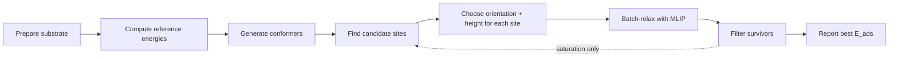

# Metalsurfer: core system

Short mental model for developers.
This covers what the code does in general.

Install / demos: [`README.md`](README.md), [`examples/`](examples/). Field knobs:
[configuration](https://metalsurfer.readthedocs.io/en/latest/guides/configuration.html).
YAML campaigns:
[yaml_campaigns](https://metalsurfer.readthedocs.io/en/latest/guides/yaml_campaigns.html).
Full mechanics (sites, placement, TorchSim, BO, validation, AdsorbML/BOSS):
[architecture](https://metalsurfer.readthedocs.io/en/latest/guides/architecture.html).

## What it does

The pipeline takes a material (the *substrate*) and a list of molecules, then
decides where on the material each molecule could plausibly stick, gives each
guess a geometry, relaxes that geometry with a machine-learned interatomic
potential, and keeps the survivors. It can repeat that loop to pack more and
more molecules onto the surface until they stop binding.

Adsorption energy — the number the whole pipeline is trying to rank — is always
computed the same way:

```text
E_ads = E_adslab - E_slab - E_molecule
```

A negative `E_ads` means the molecule prefers to be on the surface. In coverage
mode the loop stops the moment the next molecule would *cost* energy to adsorb
(`E_ads >= 0`).

## How to enter

| Want                         | Call                                                       |
|------------------------------|------------------------------------------------------------|
| Screen many molecules        | `run_adsorption` / `run_adsorption_bo`                     |
| Grow coverage on one surface | `run_saturation` / `run_saturation_bo`                     |
| YAML campaign                | `load_campaign_yaml` + `run_campaign`                      |
| Build/load the surface first | `prepare_substrate` (also `surface_prep.prepare_substrate`) |

Prefer `run_*_bo` when you want Bayesian placement selection. BO mode is chosen
by the entry point (`run_adsorption_bo` / `run_saturation_bo`) or YAML
`campaign: adsorption_bo` / `saturation_bo`; config only holds nested BO
hyperparameters (`AdsorptionConfig.bo` / `bo.transfer`). Flat `bo_*` constructor
and YAML keys are rejected.

YAML is a convenience dispatch layer (`bulk_id` / `slab_file`, inline molecules,
`skip_existing` only on `run_campaign`)—not a full substitute for `prepare_substrate`
+ `run_*` (custom ASE `slab=`, molecule CSVs, extra kwargs, post-run checks).

Inputs: `SlabContainer` or ASE `Atoms`, molecules (list or CSV),
`AdsorptionConfig`, `surface_type` (results folder label only). Prep freeze
policy is set in `prepare_substrate`, not on campaign kwargs.

## 1. The pipeline, end to end

Read this section first if you have never looked at the code. The whole system
is one loop:



Step by step, for a single molecule:

1. **Prepare the substrate.** The material — a slab, a nanoparticle, or a porous
   framework — is cleaned up and, optionally, lightly relaxed. Site *finding*
   always looks at the bare substrate atoms (where the surface geometry lives).
   Once molecules are already on the surface, *sampling* still uses that same
   site list: every remaining equivalent copy of a site is considered, and
   spots already occupied by an adsorbate are skipped.
2. **Compute reference energies.** The energy of the bare slab (`E_slab`) and of
   the free molecule (`E_molecule`) are calculated so that every later
   `E_ads` can be formed by subtraction. The same reference step also caches
   each molecule's pre-optimized conformer pack on
   `ReferenceEnergies.conformer_packs` (via `get_conformer_pack`) so placement
   reuses those geometries instead of regenerating them.
3. **Generate conformers.** The molecule is sampled into several 3D shapes (a
   *conformer* is one folded shape of the same molecule). They are cheap,
   pre-relaxed shapes; the pipeline never invents new shapes later.
4. **Find candidate sites.** The code looks at the surface geometry and returns a
   list of points where a molecule might bind — an *atop* atom, a *bridge*
   between two atoms, a *hollow* over a gap, a *pore* in a framework, and so on.
   (See §3 for how this differs per material type.)
5. **Build placements.** For each site it picks an orientation (which way the
   molecule faces the surface) and a height, producing a full 3D geometry. A
   *placement* is therefore one concrete candidate structure: a specific
   conformer, at a specific site, in a specific orientation, at a specific
   height. (See §4.)
6. **Relax.** All candidates are relaxed together in one batch using a
   machine-learned potential (UMA via TorchSim by default: model
   `uma-s-1p2`, task head `oc25` — both configurable on `AdsorptionConfig`
   as `model_name` / `task_name`).
7. **Filter and keep the best.** Relaxed candidates that crashed, flew away, or
   ended up unbound are dropped. The lowest `E_ads` wins.

In saturation mode the loop jumps back to step 4 after committing the step's
winner(s) onto the slab, refreshing `E_slab`, and continuing until the next
molecule would not bind or no valid sites remain. By default one placement is
committed per step; several can be committed at once (see §6).

The key idea to internalise: the pipeline does not hand-place one perfect pose.
It generates *many* candidate placements, lets physics decide, and reports the
survivor with the most negative `E_ads`.

## 2. The three views that matter

Almost every packing or coverage bug traces back to one of three distinctions
the code keeps deliberately separate:

1. **Substrate vs covered slab**
   Site catalogs and distance checks against the surface use a *substrate-only*
   view (the bare atoms, `slab_for_sites`). Relaxation and checks between
   already-placed molecules use the *full* slab (earlier adsorbates appended as
   a suffix). Mixing these two views is the classic source of "ghost" overlaps.

2. **Spec vs pose**
   A `PlacementSpec` is a discrete *instruction slot*: "conformer 3, site 7,
   tilt 30°, azimuth 90°". Turning that slot into actual xyz coordinates yields
   a `PlacementDescriptor`, also called the *pose*. The machine-learning features
   and the Bayesian optimizer see only absolute xyz plus a rotation
   (quaternion) — never the site index or the orientation label. CSV exports
   default to those pose features plus labels; set
   `export_placement_provenance=True` to also record the pre-relaxation
   *intent* (which site and orientation were chosen), which is not necessarily
   the final binding mode after relaxation.

3. **Prep freeze vs adsorption freeze**
   During surface preparation the bare substrate may be allowed to equilibrate
   (`slab_relaxation_mode`). During adsorbate relaxation, the substrate atoms
   that are frozen come from ASE `FixAtoms` attached back at prep time. In
   saturation the original substrate length is preserved so newly added
   adsorbate atoms are free to move.

## 3. System types: how sites are found

Everything in this section is organised by `material_type`. That one field
(`slab`, `nanoparticle`, or `porous`) decides which periodicity the geometry
uses, which site sources run, and which heuristics apply. Behind the scenes each
type maps to a periodicity: slabs are periodic in the two surface directions and
open in the third; nanoparticles are fully non-periodic; porous frameworks are
periodic in all three directions. Distance math, filters, shortest periodic
distances, and site symmetry use that material-aware periodicity
(`material_aware_pbc`), not whatever flags the ASE Atoms carry after the
calculator promotes slabs to full 3D periodicity. Stored results restore
material periodicity via `apply_material_pbc`.

A *site* is always a point in space plus a local *outward normal* (the direction
away from the material) and a *site type*. The site types are:

- `atop` — directly above a single surface atom;
- `bridge` — above the midpoint between two surface atoms;
- `hollow` — above a gap surrounded by three or four surface atoms;
- `pore` — inside the open void of a framework, far from any wall (only porous);
- `envelope` — a generic "just outside the surface" point;
- `unknown` — could not be classified.

Sites are labelled by looking at the distances from the candidate point to the
nearest surface atoms: if the nearest atom is far closer than the second, it is
atop; if the nearest two are about equally close, it is a bridge; if the nearest
three or four are equal, it is a hollow; if the nearest atom is unusually far,
it is a pore.

Which *points* are proposed is controlled by `site_generator` (default
`auto`): slabs and nanoparticles use the **topology** plugin; porous
frameworks use **Voronoi**. Explicit `topology` / `voronoi` override that
mapping when the pair is compatible with `material_type`. Opt-in
`adaptive_grid` lays a Cartesian grid around every atom (spacing in Å via
`adaptive_grid_spacing`) and then follows the same classify → cluster →
symmetry path on all materials. It is never chosen by `auto`.

### 3.1 Slab

A slab top layer is a set of atoms lying in roughly one plane. Because that
layer is *coplanar*, a 3D Voronoi diagram would collapse to a flat plane, so
the default topology plugin never attempts one there. Instead it reads the top
layer — including its ±1 periodic images along the two surface directions —
and explicitly constructs:

- **atop** candidates, one above each top-layer atom (lifted by a fraction of
  the median surface spacing);
- **bridge** candidates, at the midpoint of every top-layer edge (so cross-cell
  edges are not missed);
- **hollow** candidates, at the centroid of every top-layer triangle.

After the topology candidates are built, an *accessibility window* still
gates them: a candidate is kept only if its distance to the nearest framework
atom sits between `voronoi_probe_radius` and `voronoi_max_site_distance`. These
two knobs are scaled by the surface's covalent radii unless overridden, and
they remain active on slabs — they simply drive the topology accessibility
window rather than a Voronoi pass. (Ridge *enrichment*,
`voronoi_site_enrichment`, does nothing on a planar slab or on nanoparticles;
that knob only matters for porous frameworks and rough/non-planar slabs that
run Voronoi.)

Two extra slab behaviours:

- A **height mask** keeps only candidates at or above the surface layer, so a
  site that ended up behind a step edge is dropped.
- When `site_classification_method` is `auto` (the default) or `delaunay`, the
  code triangulates the top layer and re-classifies each candidate as atop /
  bridge / hollow against that mesh. This makes cross-periodic-boundary
  bridges and hollows classifiable that a plain distance ratio would mislabel.
  `distance_ratio` uses the raw nearest-neighbour distance rules instead.

If the topology generator produced no atop site, a small **atop-injection**
safety net lifts a candidate above each top-layer atom along the surface normal
and keeps those gated by the same window. (Slabs that already have topology atop
skip this, since it would be redundant.)

### 3.2 Nanoparticle

A nanoparticle is a finite cluster with no periodicity. Sites come from the
**convex hull plus nearest-neighbour edges** (the slab analogue for a closed
surface): atoms on the hull skin become atops, nearest-neighbour edges become
bridges, and chordless 3-/4-cycles become hollows. Candidates are lifted along
**hull-facet normals**, so the same path works for highly symmetric and
lopsided convex clusters. Voronoi is skipped — its voids are not adsorption
sites on a metal nanoparticle.

If the hull cannot be built (or topology yields no atop), a single
**atop-injection** pass lifts candidates above hull-skin atoms along the same
facet normals and gates them with the accessibility window.

### 3.3 Porous

A porous framework (a MOF/COF) is fully 3D periodic, so its Voronoi vertices
fill the void space. Vertices are the primary source plus optional ridge
enrichment. Pores versus walls are distinguished by the
nearest-atom distance: a vertex whose nearest framework atom is farther than a
covalent-radius-based threshold is a `pore` (free volume); a closer one is a
`hollow`. Open pores — those with a *larger* nearest-atom distance — are
preferred, because they are less likely to clash with the walls.

Porous frameworks do **not** use atop injection (covalent radii do not define a
unique "up" inside a confined void), and the contact-solved height in §4 is
skipped there.

### 3.4 Shared behaviour across all three types

Regardless of material type, three things happen to the raw candidate set:

- **Clustering** merges near-duplicate points into one representative within
  `site_equivalence_tolerance`. Sites merge only when they are spatially close
  *and* share the same `env_fingerprint`: sorted support-atom symbols, binned
  distances to those support atoms, and a side label (which face of a slab).
  Classified `site_type` (atop / bridge / hollow / …) is **not** part of that
  fingerprint. Which plugin proposed the point (`site_source`) is also ignored,
  so two generators that land in the same pocket collapse to one representative.
  Periodicity is respected (images folded back); slabs also require matching
  height along the surface normal. Dissociative pairs and adatom hollow
  placement use this full clustered list (hollow/pore subset) so they see every
  translational copy.
- **Symmetry reduction** uses spglib to keep one representative of each
  crystallographically equivalent site, cutting wasted work on a clean bare
  substrate. It runs after clustering. Sites of different classified
  `site_type` are not collapsed into each other. Adsorbates alone do not count
  as “broken symmetry”: saturation strips the adsorbate suffix before that
  check. Once anything is adsorbed, or when more than one molecule will be
  placed in the same step (`saturation_molecules_per_step` > 1), sampling uses
  the full clustered list again and drops occupied spots. Substrate
  reconstruction, strong ionic motion, or a failed symmetry analysis also skip
  the reduction. Multi-molecule `adaptive_grid` saturation shares one catalog;
  other generators reuse the per-geometry cache. Bayesian transfer uses
  geometry features, not site indices.
- **One-shot auto-widen.** If the very first accessibility window finds no sites
  at all, the code retries once with a wider window (tighter probe radius and a
  larger max distance, scaled by the covalent-radius-derived defaults) before
  giving up. This is `voronoi_auto_widen`.

Before those catalog steps, plugins may merge candidate *vertices* with a fixed
0.1 Å spatial tolerance (and, when Voronoi enrichment is appended to topology,
existing topology points stay frozen). That is generation-time housekeeping;
afterward uniqueness is always `site_equivalence_tolerance` (plus optional
`symmetry_tolerance` when symmetry reduction runs for molecular sampling).

Site detection results are cached per substrate geometry and relevant site /
Voronoi settings, so repeating the same material does not recompute them.

## 4. How a placement is built from a site

Once sites exist, the code turns each (site, conformer) pair into one or more
concrete placements. A placement is defined by:

- **which conformer** (which folded shape of the molecule);
- **orientation** (which way the molecule faces the surface);
- **height** (how far above the site);
- **in-plane jitter** (a small sideways nudge, used for recovery);
- **tilt and azimuth** (how much the molecule is tipped and rotated).

### 4.1 Orientation choice

The code first decides whether the molecule is *flat and aromatic* (for example
benzene, or a pyridine-like ring with binding atoms). Flatness comes from the
molecule's inertia — a flat molecule has most of its mass in a plane. Aromaticity
and binding atoms come from the SMILES string when available, otherwise from the
atom types.

Two orientation families result:

- **Parallel (π-stacking).** The molecular plane is laid flat, parallel to the
  surface — like a coin set face-down. Used for flat aromatics.
- **Binder-down.** The molecule is rotated so a binding atom (an oxygen,
  nitrogen, sulfur, or halogen) points toward the surface.

For flat aromatics the *fraction* of placements done parallel versus binder-down
is controlled by `flat_aromatic_parallel_fraction`. When
`adaptive_parallel_fraction` is on (the default), that fraction is estimated
from the molecule: a ring with no binders leans heavily parallel (≈0.8), a ring
with a single binder leans binder-down (≈0.3), and rings with several binders
scale between those based on how many binders sit on the ring.

### 4.2 Height / z-offset

After orientation, height is **contact-solved** on slabs and nanoparticles
(porous frameworks keep a fractional window without contact-solve).

1. Pick a **contact atom** from the orientation family: for binder-aligned
   (EN-down / round / vertical) the binder (`en_atom_index` or a binding-atom
   candidate); for parallel, the atom closest to the surface along the normal.
2. Set that atom’s height to the same pair-clearance floor used by validation
   (``max(min_initial_distance, covalent_sum * min_contact_ratio)``, and the
   VDW-sum floor when `reject_vdw_overlaps` is on) plus a small slack, with the
   usual site-type offset (hollow slightly closer than atop, clamped so it
   cannot breach the floor). If another atom would still sit below its own
   gate, raise the COM just enough to clear it.
3. Interpret ``z_fraction`` as a **signed offset around that contact** spanning
   the covalent-scaled ``placement_z_range`` window, so mid-window ``0.5`` is
   the contact pose and ``0.1`` / ``0.9`` remain diversity — not an independent
   guess of absolute height.

Inside confined pores the local normal is not a unique "away" direction, so
contact-solve is skipped there.

### 4.3 Validation and distance recovery

Before relaxing, each placement is checked against the surface: the closest
adsorbate–substrate distance must exceed a floor (the larger of
`min_initial_distance` and a covalent-radius-based minimum), and optionally must
not exceed `max_initial_distance`. If `reject_vdw_overlaps` is on, hard
van-der-Waals clashes are also rejected.

If a placement fails these checks, the code can **recover automatically**
(`placement_distance_recovery`, on by default). It applies **one** analytic
height nudge when the failure is along the surface normal (`too_close`,
`too_far`, `contact_distance_too_large`, `vdw_overlap`; inside porous
frameworks it moves toward the free-volume site centre instead). Mostly
in-plane penetrations skip the height nudge. Huge normal penetration (molecule
clearly through the surface) fails cheaply before Packmol clash. When
`placement_clash_descent` is on, a Packmol-style rigid-body clash descent
follows, with discrete in-plane offsets as a cheap fallback. Only `too_close`,
`too_far`, `contact_distance_too_large`, `vdw_overlap`, and `adsorbate_overlap`
are recoverable; other failures are final.

## 5. Sampling many placements

For every (conformer, site) pair the code enumerates a full Cartesian grid of
variations: every conformer, a set of tilts, a set of azimuthal rotations, a set
of height fractions, and the site itself. The grid is capped at an internal
upper bound so a tiny molecule on a huge surface cannot explode the count.

Because that raw grid is far larger than the number of placements you actually
want (`num_placements`), the code takes a **deterministic, stratified subsample**
down to the requested count:

- Within each site-type bucket, candidates are ordered by a soft prior that
  prefers *milder tilts* and *mid-window heights* (so the sample is not biased
  toward extreme poses).
- For flat aromatics the parallel and binder-down branches are each subsampled
  proportionally to the parallel fraction from §4.1.
- For porous frameworks, pore sites are drawn first and in an order biased
  toward the most open pores.
- The whole draw is seeded (`seed`) and reproducible: same inputs, same placements.

Two further behaviours:

- **Conformer Boltzmann prior.** When `conformer_weighting="boltzmann"` and the
  conformer energies are available, the slots are allocated across conformers in
  proportion to `exp(-(E_i - E_min) / (k_B * T))` using `boltzmann_temperature`.
  Higher temperature flattens the preference toward uniform; lower temperature
  concentrates on the lowest-energy conformers. If energies are missing the code
  silently falls back to the uniform draw.
- **Conformer-count budgeting across molecules.** The function
  `estimate_conformer_count` scores each molecule by its conformer count
  (floor of 1), and `distribute_placement_budget` splits the total placement
  budget across molecules in proportion to those scores, guaranteeing every
  molecule gets at least one. Fill-loop clamping still uses
  `estimate_placement_spec_capacity` (enumerable policy-grid size) so retries
  stop when the requested count exceeds what can be enumerated.

## 6. Coverage and saturation

When molecules are already on the surface (saturation, or any retry round), the
pipeline prunes sites that are *occupied*.

**Occupancy pruning** keeps sites whose vertex is at least
`min_adsorbate_separation` from every existing adsorbate atom (shortest
periodic distance under periodicity). When `occupancy_use_footprint` is on
(default), surviving sites are ranked by lateral footprint clearance (incoming
in-plane disk scaled by `occupancy_footprint_scale`) so open sites are tried
first — footprint is a sort key, not a second reject mask. Topology-sourced
sites still come first. For porous frameworks open pore sites are still
preferred after that ranking.

If occupancy pruning removes *all* sites under coverage (vertex mask empty),
the capacity for that step is empty. The code does **not** fall back to
random (x, y) scatter guesses — it simply reports zero available sites and moves
on. This avoids packing molecules on top of each other inside a filled region.

Distance recovery (`placement_distance_recovery`) applies one analytic height
nudge, then a chemistry-scaled Packmol-style clash descent
(`placement_clash_descent`, default on). Discrete XY jitter remains as a
fallback when clash is off or does not fully clear.

On top of pruning, a **one-shot fill** in the workflow makes sure you actually
get close to `num_placements` valid structures:

- **Capacity clamp** (`placement_fill_clamp_to_capacity`, default `True`). The
  success target is clamped to the enumerable spec capacity, so fill cannot
  request more successes than occupancy-aware enumeration can supply.
- **Oversample** (`placement_retry_oversample_max`, default 6.0). One pass
  requests up to `num_placements * oversample` specs (capped by capacity when
  clamping is on), then **materializes in chunks** of about `num_placements`
  and stops early once the target is met.
- **Optional diversity retry** (`placement_retry_enabled`, default `True`). If
  the first pass is short and at least one spec failed materialization, one
  extra round re-enumerates excluding those exact failed-spec keys and any
  `site_index` that failed with `adsorbate_overlap`. Pose failures
  (`too_close`, etc.) do **not** ban other sites that share an
  `env_fingerprint` — on a clean metal every atop can share one fingerprint.

### 6.1 Saturation run modes

Three ways to grow the coverage, set on `AdsorptionConfig`:

- **Sequential (default).** One molecule at a time; each step screens that
  molecule's pool and folds its best binder into the slab. Molecules are
  processed in input order, each on the slab left by the previous one.
- **Competitive multi-molecule** (`multi_molecule_saturation=True`, two or
  more molecules). All molecules compete at every step: the placement budget
  is split across them in proportion to how many placements each can still
  enumerate, every pool is screened on the same current slab, and the best
  binder advances the surface. Each molecule keeps its own BO memory chain in
  `run_saturation_bo`. A real example running water and hydroxide together on
  rutile TiO₂(110) lives at `examples/water_oh_rutile_saturation.py`.
- **n-tuplet steps** (`saturation_molecules_per_step > 1`). Instead of one
  placement per step, up to *n* winners are committed simultaneously: pools
  are screened exactly as above, then winners are greedily picked by ascending
  Ω (ties broken deterministically), keeping only pairs whose
  adsorbates stay at least `min_adsorbate_separation` apart under periodicity —
  or, when `placement_clash_descent` is on, near-miss clashes that a bounded
  rigid-body slide can clear. Units 2..n are then sequentially packed against
  the frozen best binder before ONE composite structure is relaxed; if that
  composite fails validation, the step retries with the best winner alone
  before giving up. Every committed row carries the full tuplet E_ads
  (`E(composite) - E_slab - sum of molecular references`), with per-unit
  identity preserved via `placement_id`, molecule name, descriptor columns,
  per-unit distance, and an extra `committed_molecule` CSV column emitted only
  for multi-winner steps.

**Reservoir ranking.** Pick and stop use
`Ω = E_ads − k_B T ln(a_i · p / p°)` with optional
`saturation_temperature` (K), `saturation_pressure` (bar),
`saturation_activities` (list parallel to molecules), and
`saturation_omega_shift` (eV scalar or per-species sequence subtracted
from Ω). SATP defaults
(`T = 298.15 K`, `p = p° = 1 bar`, `a_i = 1`, `δ = 0`) recover `Ω = E_ads`.
n-tuplet stop uses `Ω_tuplet = E_ads_tuplet − k_B T Σ ln(a_i p / p°)`.
Stored `energy_adsorption` / BO `observed_y` stay electronic. If activities
already encode `p_i / p°`, leave pressure at 1 bar. Not
`boltzmann_temperature` (conformer prior only).

All three modes stop when a step commits nothing (including n-tuplet
`no_binders` / emptied pack), committed Ω (or Ω_tuplet) ≥ 0, no valid
placements remain, or `saturation_max_steps` is reached.

## 7. Dissociative placement

Some molecules, such as H₂, do not stay intact on a surface — they split into two
atoms that sit on two separate sites. This is handled by a dedicated path enabled
with `enable_dissociative_placement` (usually together with
`skip_topology_check`, so the connectivity filters allow a fragmented adsorbate).

It applies only to *homonuclear diatomics* (two identical atoms, e.g. H₂, O₂,
N₂) on `slab` or `nanoparticle` (not porous). The code pairs up nearby hollow /
pore sites and places one fragment atom at each. The separation between the two
fragments is chosen adaptively: a minimum set by the atoms' covalent radii and a
maximum set by the spacing between neighbouring hollow sites, clipped to a sane
range. The resulting geometry is stored not just as xyz but with an explicit
*fragment positions* record, so replaying the placement reproduces the split
exactly.

## 8. Where the detail lives

Field reference for `AdsorptionConfig` (and nested `bo` / `bo.transfer`) is maintained
in Sphinx only — see the configuration guide and API config pages below, not
hand-copied tables here.

| Topic | Doc |
|-------|-----|
| API layers, sites, placement, TorchSim, BO, validation, materials, outputs, AdsorbML/BOSS | [Architecture](https://metalsurfer.readthedocs.io/en/latest/guides/architecture.html) |
| `AdsorptionConfig` recipes and common mistakes | [Configuration](https://metalsurfer.readthedocs.io/en/latest/guides/configuration.html) |
| YAML schema, limitations, demo files | [YAML campaigns](https://metalsurfer.readthedocs.io/en/latest/guides/yaml_campaigns.html) |
| Prep, freeze, resize, adatoms | [Surface engineering](https://metalsurfer.readthedocs.io/en/latest/guides/surface_engineering.html) |
| Field reference | [API: config](https://metalsurfer.readthedocs.io/en/latest/api/config.html), [API: campaigns](https://metalsurfer.readthedocs.io/en/latest/api/campaigns.html), [API: surface_prep](https://metalsurfer.readthedocs.io/en/latest/api/surface_prep.html) |
| Tests / CI | [Development](https://metalsurfer.readthedocs.io/en/latest/guides/development.html) |

Python **3.12+**. Core deps: `numpy`, `ase`, `pandas`, `rdkit`, `scipy`,
`scikit-learn`, `spglib`. Optional MLIP stack: `torch`, `torch-sim-atomistic`,
FairChem/UMA.
